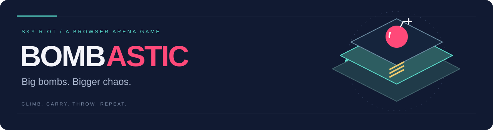
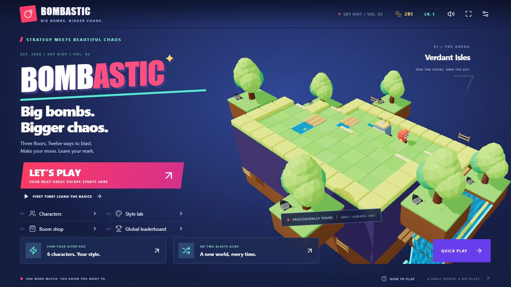

A 3D browser arena game with connected terraces, tactical bots, animated water and bold menus. Built with React, TypeScript and Three.js.

 · [Controls](CONTROLS.md) · [Hosting guide](DEPLOYMENT.md) · [Creator's portfolio](https://ahsanhere.me)

| Arena | Combat | Rankings |
| :--- | :--- | :--- |
| 1–3 floors, stairs, rivers and bridges | Carry and throw bombs; face an active boss | Daily and all-time boards with server replay checks |

**AI-assisted development.** In-game bots use rule-based decisions and A* pathfinding. The game does not require an LLM or an AI service to run.

## Included

- One, two or three connected floors, gold stairs and floor-specific blast propagation.
- Rivers, wooden bridges, waterfalls, swaying stylized trees, fireflies and saturated biome materials.
- Classic Battle, Free-for-All, five-wave Survival, Bomb Mayhem and King Kaboom.
- A boss that hunts across stairs, telegraphs charges/shockwaves and summons Fuseling minions in later phases.
- Six characters, cooldown abilities and tactical A* bots with four difficulties and personalities.
- Twelve bomb behaviors. Start with Standard, Ice, Cluster and Remote; collected types join the switchable arsenal.
- Pick up your own or an opponent's bomb, carry a live fuse and throw in an animated arc across obstacles/floors. Base range is two tiles; Throw pickups extend it to four. Kick makes bombs roll until blocked.
- Regular supply drops, kill combos, impact rings, particles, squash/stretch motion, shake and sound cues.
- Red hit blinking on every fighter including the boss, plus cyan shield feedback. Reduced Motion uses a steady hit tint.
- Customization, shop, achievements, challenges, saved progression, tutorial, pause, rematch and configurable controls.
- Shared daily/all-time ranked boards, server-verified replays and one best score per player.

## Controls

**WASD / arrows** move · **Space** plant · **E / Shift** ability · **Q** pick up / throw · **R** cycle bomb · **F** detonate remotes · **Esc** pause · **Tab** standings. Arsenal and ability HUD buttons are clickable. Game actions can be rebound in Settings.

Stairs connect floors. Blasts stop at height boundaries; throws can cross them. Wading slows movement, bridges preserve speed and water shortens lingering fire.

## Vercel hosting

Import the personal GitHub repository as a **Vite** project. `vercel.json` supplies install/build/output settings; `api/` contains the cloud leaderboard functions. The game deploys without a database, but ranked play stays offline until storage is connected.

1. Import the repository from your **nexonomy personal account**, not an organization.
2. Use **Vite**, build `npm run build`, output `dist`, Node.js **22.x**.
3. Connect **Upstash Redis** through Vercel Storage/Marketplace. Set server-only `UPSTASH_REDIS_REST_URL` and `UPSTASH_REDIS_REST_TOKEN` for Production and Preview. Enter credentials directly in Vercel; never commit them or prefix them with `VITE_`.
4. Redeploy after storage setup; `/api/health` verifies connection. Production and preview boards have separate namespaces by default.
5. Future pushes to `main` can deploy through Vercel Git integration. GitHub Actions runs tests/build without deployment credentials.

See [DEPLOYMENT.md](DEPLOYMENT.md) and [.env.example](.env.example). Vercel uses Redis; SQLite is local-only. No local database or browser save belongs in the repository.

## Ranked rules

Ranked runs use a daily seed, three floors, Hard bots and two-minute Free-for-All. Submit a completed run from Results. The server replays inputs and computes points: victory +1,000, KO +150, crate +10, pickup +15 and fast-victory bonus. Supplied score numbers are ignored. Sessions expire after one hour and cannot be submitted twice.

This is an anonymous leaderboard: IDs live in browser storage. Replay verification enforces game rules but does not prevent automated play or multiple identities. Names/scores become visible to other players when submitted. There are no fabricated entries.

## Assets and scope

Characters, trees, water shaders, UI, gameplay, audio and repository banners were created for this project. Selected crates, rocks, barrels and stone meshes/textures come from the supplied KUBIKOS World package and retain their original license; see [NOTICE.txt](public/assets/NOTICE.txt). Public source access does not grant a separate license to these third-party assets. The original package is untouched; extraction/source copies stay in ignored `.reference/`.

Desktop keyboard gameplay is supported. Touch/gamepad, local/online multiplayer, team battle, moving gates/conveyors, breakable bridges, seasonal cosmetics and character unlock trees are not implemented. Floors are connected terraces at different elevations rather than overlapping indoor storeys. Low graphics/resolution scaling are available.

Further documentation: [CONTROLS.md](CONTROLS.md), [GAME_DESIGN.md](GAME_DESIGN.md), [ARCHITECTURE.md](ARCHITECTURE.md).
